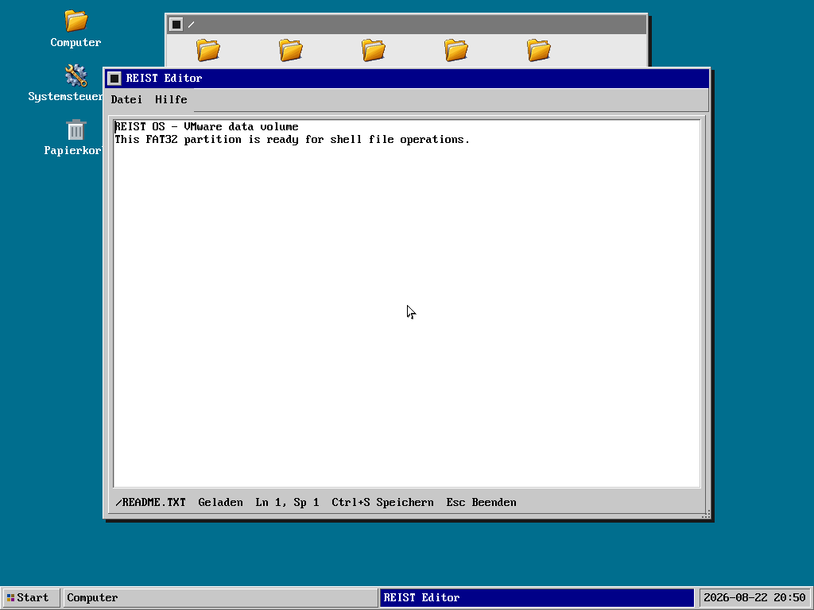

# GUI-Komponenten, Controls und Dialoge

Stand: 27. August 2026.

Dieses Dokument ist der technische Katalog für sichtbare und interaktive
REIST-GUI-Komponenten. Es trennt bereits nutzbare API von compositorinternen
Bausteinen und geplanter Arbeit. Ein Häkchen bedeutet, dass Quell-API,
Verhaltenstest, SDK-Installation und mindestens eine reale Verwendung
vorhanden sind; eine gezeichnete Attrappe allein gilt nicht als Control.

## Ziel und Schichten

REIST übernimmt etablierte Interaktionsmodelle, aber behauptet keine
Binärkompatibilität zu Win32, Qt, GTK oder Wayland. Wiederverwendbare Controls
sind rendererunabhängige, versionierte C11-Zustandsautomaten in
`libreistgui.a`. Der Compositor besitzt globale Platzierung, Z-Order,
Fensterdekoration und Eingaberouting. Ein Surface-Client besitzt nur seine
lokale Oberfläche und die Controls darin; Notepad und Image Viewer verwenden
diesen Vertrag bereits produktiv.

Top-Level- und Dialog-Surfaces bezeichnen ausschließlich die Clientfläche.
Der Window Manager zeichnet genau einen äußeren Rahmen samt Titel, Fokus,
Verschieben, Größenänderung und Schließen. Anwendungen dürfen darin keinen
zweiten Fensterrahmen und keine zweite Titelleiste nachbilden. Paint- und
Pointerkoordinaten beginnen immer bei `(0, 0)` der Clientfläche. Diese
Aufteilung entspricht der etablierten Trennung von Client- und Non-Client-Area
bei nativen Desktoptoolkits; `libreistgui` stellt die portierbaren Controls und
Layoutzustände bereit, ohne Win32-, Qt-, GTK- oder Wayland-Kompatibilität zu
behaupten. Control Gallery und Notepad folgen demselben Vertrag.

```text
GUI-Anwendung
  -> Layout und Controls aus libreistgui
     -> lokale Paint-Liste und lokale Events
        -> versioniertes Surface-/Event-Protokoll
           -> Session-Compositor und Window-Manager
              -> validierte Display-ABI
```

Ein öffentliches Control darf weder Framebufferadressen noch globale
Fensterkoordinaten, Gerätezugriff oder Prozessrechte besitzen. Geometrie ist
lokal und halb offen: `[x, x + width)` und `[y, y + height)`.

## Verbindliche Zustände und Ereignisse

Alle interaktiven Controls verwenden, soweit für ihren Typ sinnvoll, dieselben
Grundbegriffe:

- `visible`, `enabled` und `read_only` bestimmen Teilnahme an Layout, Hit-Test
  und Änderung.
- `hovered` ist Pointer-Feedback ohne Eingabebesitz.
- `pressed` gilt nur während eines passenden Button-Down/Up-Capture.
- `focused` bezeichnet genau ein Keyboardziel innerhalb einer Fokusgruppe.
- `default` und `cancel` benennen die Enter- beziehungsweise Escape-Aktion.
- `checked`, `selected`, `expanded`, `indeterminate` und `invalid` sind
  typspezifische semantische Zustände, keine reinen Farben.

Pointer-Capture beginnt nur nach einem akzeptierten Button-Down und endet
begrenzt mit Button-Up, Abbruch oder Zerstörung. Keyboardnavigation verwendet
eine deterministische Fokusreihenfolge. Zustandsänderungen liefern eine feste
Anzahl lokaler Damage-Rechtecke; Überlauf fordert einen vollständigen Redraw
der betroffenen Surface an.

Retained-Command-Surfaces besitzen zusätzlich zur kompatiblen Basisliste
append-only Protokollerweiterungen fuer Overlay, dynamischen Inhalt und Hover.
Alle Listen werden unabhängig atomar ersetzt; der Compositor zeichnet immer
Base, Dynamic, Overlay und Hover in dieser Reihenfolge. Die Grenzen sind 192,
192, 96 und vier Kommandos.
Ungültige Layer oder ein Commit für den falschen aktiven Layer scheitern vor
einer sichtbaren Zustandsänderung. Der REIST Editor hält statische Geometrie in
der Basis, Dokument, Scrollleisten und Statuszeile in Dynamic, Menü und Dialoge
in Overlay sowie nur aktiven Titel und hervorgehobenen Eintrag in Hover. Ein
Scroll-Drag ersetzt dadurch keine statische Basis; ein Hoverwechsel uebertraegt
hoechstens vier Kommandos. Separate Dialog-Surfaces und ältere
Clients verwenden unverändert die Basis-API; Eingaben werden nicht in laufende
Transaktionsantworten umsortiert.

Der Broker verarbeitet pro Desktopumlauf höchstens 64 faire Scheiben zu je
einer IPC-Queue-Tiefe. Damit passt ein kompletter, weiterhin fest auf 192
Kommandos begrenzter Retained-Paintframe in einen Umlauf. Ein nach jedem
Queue-Drain freigegebener Produzent erhält auf seiner anderen CPU unmittelbar
einen begrenzten Scheduler-IPI statt erst den nächsten periodischen Tick
abzuwarten. Jedem aktiven Client wird auch während eines Paint-Bursts höchstens
ein zusammengefasstes Eingabeereignis angeboten. Eine volle ausgehende Queue
verschiebt dieses Ereignis, beendet aber nicht den Client.
Beim Commit vergleicht der Server die alte und neue feste Paint-Liste und
vereinigt nur Rechtecke geänderter, hinzugefügter oder entfernter Kommandos in
einen lokalen Präsentationsschaden. Identische Commits erzeugen keine neue
Paint-Generation. Damit zeichnet Menü-Hover nicht mehr das vollständige
Notepad-Fenster neu; mehrere noch nicht präsentierte Commits bleiben durch das
eine begrenzte Vereinigungsrechteck abgedeckt.
Diese Reduktion gilt ausdruecklich auch auf einem System mit nur einer CPU.

Im Produktionsprofil bleiben Session-Compositor und gewöhnliche Surface-
Clients gemeinsam auf CPU 0. Ein maximaler Retained-Paintframe benötigt damit
keine Folge von CPU-übergreifenden Queue-Refills und Reschedule-IPIs. Storage,
Netzwerk, HDA, Audio-Service und freigegebene Gerätetreiber dürfen weiterhin
ihre getrennt geprüften AP-Masken verwenden. Die geschützte post-ready AP-
Affinität des Compositors bleibt implementiert, wird aber erst mit einem
expliziten Paint-Batching- und gemeinschaftlichen GUI-Affinitätsnachweis wieder
als Produktionsvorgabe aktiviert.

## Unterstützungsstatus

| Komponente | Öffentliche API | Rendering | Pointer | Tastatur | Status |
|---|---:|---:|---:|---:|---|
| lokale Rechteckgeometrie | ja | n/a | n/a | n/a | [x] gemeinsam versioniert |
| Menüleiste und Popup-Menü | ja | Desktop-Theme | Capture | Pfeile, Enter, Esc | [x] nutzbar |
| Top-Level-Fensterrahmen | nein, serverseitig | ja | Fokus, Move, Resize, Close | Fokus/Open | [x] compositorintern |
| Alert-/Message-Dialog | ja | Desktop-Theme | Buttons, Close, Move | Fokus, Enter, Esc | [x] Basis-API |
| allgemeiner Dialogcontainer | Basis vorhanden | Basis vorhanden | modal/modeless | Ergebnisdispatch | [ ] Clientinhalt fehlt |
| Label | ja | Control Gallery | n/a | n/a | [x] semantischer Name und lokale Geometrie |
| Push Button | ja | Control Gallery/Dialog | Capture/Aktivierung | Tab, Space, Enter | [x] allgemeines Control |
| Checkbox | ja | Control Gallery | Capture/Umschalten | Tab, Space | [x] zwei- und dreistufiger Zustand |
| Radio Button | ja | Control Gallery | Capture/Auswahl | Tab, Space, Pfeile | [x] exklusive Gruppe |
| verschachtelte Container | ja | Control Gallery | adressierter Eventpfad | Parent-Capture/Target/Bubble | [x] Parent-lokale Geometrie und Ancestry-Clip |
| Tabs | ja | Control Gallery | Capture/Auswahl | Links/Rechts, Home/End, Enter/Space | [x] vier interaktive Seiten |
| einzeiliges Textfeld | ja | Control Gallery | Fokus/Cursor-Capture | Cursor, Editieren, Enter | [x] begrenztes ASCII-v1-Textfeld |
| mehrzeiliger Texteditor | ja | REIST Editor | Click/Cursor und zwei Scrollleisten | Cursor, Editieren, Zeilenwechsel | [x] fester UTF-8/LF-Puffer, Skalarcursor, Laden/Speichern, Dirty-State und horizontaler/vertikaler Viewport |
| Liste und Listenauswahl | ja | Control Gallery | Capture/Auswahl | Pfeile, Home/End, Page, Enter | [x] feste Itemkapazität |
| Scrollbar | ja | Control Gallery | Drag-Capture | Pfeile, Page, Home/End | [x] gemeinsame Range-API |
| ScrollView | nein | nein | nein | nein | [ ] Containerkopplung noch offen |
| Baumansicht | nein | nein | nein | nein | [ ] für Dateimanager geplant |
| ComboBox | nein | Popup-Menü wiederverwendbar | nein | nein | [ ] geplant |
| Slider und SpinBox | ja | Control Gallery | Drag-Capture | Pfeile, Page, Home/End | [x] gemeinsame Range-API |
| Fortschrittsanzeige | ja | Control Gallery | n/a | n/a | [x] read-only Range-Control |
| Toolbar und Statusbar | nein | Desktopleisten vorhanden | nein | nein | [ ] API definieren |
| Tooltip | nein | nein | nein | n/a | [ ] erst mit monotonem Timer |
| Kontextmenü | Menücontroller verwendbar | ja | Capture | Pfeile/Enter/Esc | [ ] öffentlicher Öffnungsanker fehlt |
| Datei-Öffnen-/Speichern-Dialog | ja | REIST Editor | modal, Pfadfeld und Buttons | Tab, Editieren, Enter/Escape | [x] asynchroner absoluter Pfad-Chooser v1 |
| Farb- und Fontdialog | nein | nein | nein | nein | [ ] spätere Systemdienste |
| interaktive Control Gallery | Surface-, Menü-, Dialog- und Basis-Control-API | ja | ja | ja | [x] `/usr/gui/bin/guidemo.prg`, unabhängiger Surface-Client |
| grafischer Texteditor | Texteditor-, Menü- und Dialog-API | ja | Cursorplatzierung | Editieren/Navigation/Save | [x] `/usr/gui/bin/notepad.prg` |
| Bildbetrachter | Surface-Client- und Image-API | XRGB8888-Buffer | Fensterinteraktion | Close | [x] `/usr/gui/bin/imageviewer.prg` |
| Sound Player | Surface-, Control- und Audio-API | Retained-Paint-Fenster | Buttons und lokaler Pointer | Aktivierung/Close | [x] `/usr/gui/bin/soundplayer.prg`, unabhängiger Surface-Client |



*Automatischer QEMU-Nachweis: Notepad zeigt `/readme.txt` in einem vom
Desktop-Compositor verwalteten Ring-3-Fenster.*

## Interaktive Referenzanwendung

`userspace/gui/apps/control_gallery/main.c` ist die ausführbare Referenz für
den aktuell freigegebenen API-Umfang. Beide Image-Builds installieren sie als
`/usr/gui/bin/guidemo.prg`; der begrenzte Standard-Suchpfad der Ring-3-Shell
macht sie mit `guidemo` direkt startbar. Die Anwendung bindet ausschließlich
`x86os.h` und die öffentlichen `<reist/gui/...>`-Header ein und besitzt keinen
Zugriff auf private Compositor-Header. Der Desktop delegiert genau einen
generationsgebundenen Surface-Endpunkt; Zeichnen, Pointer- und Tastaturereignisse
bleiben dadurch clientlokal und der Compositor wartet nicht auf das Ende der
Galerie.

Interaktiv nachweisbar sind verschachtelte Page-/Gruppencontainer, Tabs,
Label, Pushbutton, Checkbox, exklusive Radiogruppe, einzeiliges Textfeld,
Liste, Scrollbar, Slider, SpinBox, Fortschrittsanzeige, Menüleiste, Popup-Menü, modeless und
application-modal Dialoge, semantische Responses, Default-/Cancel-Buttons,
Tastaturfokus, Enter/Escape, Schließfeld und Verschieben per Pointer-Capture.
Komplexe noch nicht implementierte Controls werden nicht als Attrappen
gezeichnet. Surface-Erzeugung und Eingabebatches sind fest begrenzt; Close,
Resize, Protokollfehler und Compositorverlust führen über denselben
idempotenten Destroy-/Release-Pfad.

Der Surface-Broker behandelt ein geschlossenes Client-Ende nicht als
ausreichenden Prozessabschluss. Er widerruft zuerst alle generationengebundenen
Surfaces und schliesst den Endpoint, beobachtet danach die exakte
Prozessidentitaet ohne blockierendes `wait` und erntet erst nach festgestelltem
Exit. Ein nach 1000 ms noch lebender Client wird einmalig beendet; eine
fremde oder ungueltige Generation bleibt quarantiniert und wird nie als das
urspruengliche Kind behandelt. Damit koennen wiederholte Starts weder den
Compositor blockieren noch unbemerkt dessen feste Prozessplaetze aufbrauchen.

## Vertrag der Basis-Controls

`<reist/gui/control.h>` fasst Label, Pushbutton, Checkbox und Radio Button
unter gemeinsamen, rendererunabhängigen Zuständen zusammen. Das lehnt sich an
den gemeinsamen Button-Unterbau von
[Qt `QAbstractButton`](https://doc.qt.io/qt-6/qabstractbutton.html) an, ohne
dessen Klassen- oder Signal-ABI zu übernehmen. Ein Descriptor enthält stabile
ID, semantische Rolle, zugänglichen Namen, lokale Geometrie, Aktion und Flags;
der caller-owned State enthält ausschließlich Fokus, Hover, Pointer-Capture
und Werte für höchstens 16 Controls.

- Button-Down bindet genau ein aktiviertes Control bis Button-Up oder Cancel.
  Nur ein Release innerhalb desselben Controls aktiviert die Aktion.
- Space aktiviert das fokussierte Button-Control. Enter aktiviert einen
  fokussierten Pushbutton oder den einzigen expliziten Default-Pushbutton.
- Checkboxen folgen dem
  [W3C Checkbox Pattern](https://www.w3.org/WAI/ARIA/apg/patterns/checkbox/)
  mit `unchecked`, `checked` und optionalem `mixed`. Eine Benutzeraktivierung
  führt `mixed` nach `checked`; Anwendungen dürfen alle drei Zustände
  programmatisch setzen.
- Radiogruppen folgen dem
  [W3C Radio Group Pattern](https://www.w3.org/WAI/ARIA/apg/patterns/radio/):
  höchstens ein Eintrag ist ausgewählt, Tab behandelt die Gruppe als einen
  Fokus-Stopp und Pfeiltasten verschieben Fokus und Auswahl mit Wrap-around.
- Unsichtbare oder deaktivierte Controls nehmen weder an Hit-Test noch Fokus
  oder Aktivierung teil. Label sind grundsätzlich nicht interaktiv.
- Jede Operation validiert Version, Strukturgröße, Reserved-Felder,
  Geometrie, IDs, Rollen und Radio-Exklusivität vor der Mutation. Damage ist
  auf acht lokale Rechtecke begrenzt und fällt kontrolliert auf die ganze
  caller-owned Surface zurück.

## Container, Tabs und Eventkommunikation

`<reist/gui/container.h>` beschreibt einen festen Widgetbaum mit höchstens 32
Nodes. Node null ist der Root-Container; jeder weitere Node verweist nur auf
einen bereits definierten Parent-Container. Dadurch sind Container in
Containern ausdrücklich erlaubt, während Zyklen und verwaiste Children ohne
rekursive Suche abgewiesen werden. Child-Geometrie ist parent-lokal. Die
aufgelöste Clipregion ist der Schnitt aller Containergrenzen der Elternkette.

Controls kommunizieren nicht über globales Message-Broadcasting und kennen
keine Geschwister. Der Baum erzeugt für einen Pointertreffer genau einen
adressierten Pfad `Root -> ... -> Target`. Die Anwendung kann diesen Pfad in
drei festen Phasen bearbeiten: Parent-Capture, genau ein Target und
Parent-Bubbling. Ein Handler darf die Weitergabe beenden. Das typisierte
Controlresultat (`changed`, `activated`, ID, Wert und Damage) geht an den
Anwendungs-Controller; nur dieser aktualisiert abhängige Modelle gezielt. In
der Galerie setzt zum Beispiel ein Slider-Resultat die Fortschrittsanzeige.
Unbeteiligte Geschwister erhalten kein Ereignis.

`<reist/gui/tabs.h>` trennt Tab-Leiste und Page-Container. Genau eine
aktivierte Seite ist sichtbar. Links/Rechts navigieren mit Wrap-around,
Home/End wählen die Ränder und Enter/Space aktivieren. Da die lokalen Seiten
ohne Ladezeit vorliegen, folgt die Auswahl dem Tastaturfokus automatisch. Das
entspricht dem [W3C Tabs Pattern](https://www.w3.org/WAI/ARIA/apg/patterns/tabs/)
und der üblichen Trennung von Tab-Bar und Page-Stack, ohne eine fremde ABI zu
behaupten.

## Text-, Listen- und Range-Controls

`<reist/gui/value_controls.h>` stellt drei begrenzte Zustandsautomaten bereit:

- Das einzeilige Textfeld besitzt einen caller-owned Puffer mit höchstens 64
  Bytes, Cursor, Fokus und Pointer-Capture. Version 1 akzeptiert bewusst nur
  druckbares ASCII. Clipboard, UTF-8-Grapheme und IME-Komposition bleiben eine
  explizite spätere ABI-Grenze und werden nicht vorgetäuscht.
- Die Liste enthält höchstens 32 caller-owned Items mit stabiler ID,
  semantischem Label, Enabled-Zustand, Auswahl und begrenztem Viewport.
- Slider, vertikale/horizontale Scrollbar, SpinBox und read-only
  Fortschrittsanzeige teilen einen geprüften Integerbereich mit Minimum,
  Maximum, Step und Page-Step. Pointerwerte und Tastaturschritte werden mit
  64-Bit-Zwischenwerten begrenzt berechnet.

Alle Modelle bleiben rendererunabhängig, heap-frei und ohne Geräte- oder
Framebufferzugriff. Jedes sichtbare Element trägt einen semantischen Namen;
`guidemo.prg` ordnet sie auf den Tabs `Basis`, `Eingabe`, `Auswahl` und
`Werte` an.

`<reist/gui/text_editor.h>` erweitert diesen Vertrag um ein mehrzeiliges,
caller-owned Dokument mit höchstens 200 Zeilen zu je 255 ASCII-Zeichen,
Cursor, horizontalem/vertikalem Viewport, Pointer-Capture und explizitem
Dirty-State. Persistenz bleibt Anwendungsverantwortung; erst nach erfolgreichem
`fsync` und Rename ruft `notepad.prg` `reist_gui_text_editor_mark_saved()` auf.
Damit kann ein fehlgeschlagener Schreibpfad den sichtbaren Dirty-State nicht
fälschlich löschen.
Scrollbar-Drag übernimmt den bereits begrenzten neuen Zeilen- oder Spaltenwert
direkt in den gecachten Viewport. Die bis zu 200 Dokumentzeilen werden nicht
bei jeder absoluten Pointerbewegung erneut nach der längsten Zeile durchsucht;
eine vollständige Synchronisierung folgt nur auf eine echte
Editor-Geometrieänderung.

`<reist/gui/file_dialog.h>` stellt dazu einen wiederverwendbaren,
rendererneutralen Datei-Öffnen-/Speichern-Controller bereit. Er folgt demselben
asynchronen `open`/`dispatch`/`complete`-Muster wie die übrigen Dialoge und
startet weder eine verschachtelte Eventloop noch blockierende VFS-Operationen.
Version 1 bearbeitet einen absoluten ASCII-Pfad mit Tastaturfokus,
Pointer-Capture, Enter als Accept und Escape als Cancel. Der Controller
liefert ausschließlich eine kopierte Pfadauswahl; Existenzprüfung, Laden,
atomarer Speicherpfad, Überschreibpolitik und Fehlermeldungen bleiben beim
aufrufenden Programm. Eine spätere visuelle Verzeichnisliste wird als
versionierte, durch einen Dateisystemdienst gelieferte Erweiterung ergänzt und
nicht durch versteckte VFS-Zugriffe in einem Control vorgetäuscht.

## Dialogvertrag

Die REIST-Dialog-API folgt den gemeinsamen, weiterhin aktuellen Mustern von
[GTK 4 `AlertDialog`](https://docs.gtk.org/gtk4/class.AlertDialog.html),
[Qt 6 `QDialog`](https://doc.qt.io/qt-6/qdialog.html) und
[Qt 6 `QMessageBox`](https://doc.qt.io/qt-6/qmessagebox.html): Ein Dialog hat
einen Owner, eine Modalität, explizite Buttons, eine Default- und eine
Cancel-Aktion sowie einen auslesbaren Ergebniswert. Standardbuttons und ihre
semantischen Rollen entsprechen dem Prinzip von
[Win32 Task Dialogs](https://learn.microsoft.com/en-us/windows/win32/api/commctrl/nf-commctrl-taskdialogindirect),
nicht deren ABI oder numerischen Konstanten.

REIST verwendet ausschließlich ein asynchrones `open`/`dispatch`/`complete`-
Modell. Es wird keine zweite, verschachtelte Eventloop wie bei einem
blockierenden `exec()` gestartet; auch Qt empfiehlt `open()`, um solche
Nebenwirkungen zu vermeiden. Abschluss wird genau einmal als typisierte
Response publiziert.

- **modeless:** Eingaben außerhalb des Dialograhmens werden nicht konsumiert
  und können an Menü, Fenster oder Anwendung weiterlaufen.
- **window-modal:** Nur der generationsgebundene Owner und dessen abhängige
  Controls sind gesperrt; andere Top-Level-Fenster bleiben grundsätzlich
  bedienbar, sobald die Surface-ABI dies unterscheiden kann.
- **application-modal:** Alle normalen Ziele der Session sind inert, bis eine
  Response oder ein kontrollierter Abbruch den Dialog schließt.
- **Default/Cancel:** Enter aktiviert den fokussierten oder den expliziten
  Defaultbutton; Escape und das Schließfeld liefern die konfigurierte
  Cancel-Response. Fehlt eine zulässige Cancel-Response, darf Escape den
  Dialog nicht stillschweigend schließen.
- **Verschieben:** Ein Button-Down in der Titelleiste erwirbt ein implizites
  Move-Capture. Die Geometrie bleibt vollständig im Arbeitsbereich; Button-Up
  beendet das Capture auch außerhalb des Rahmens.
- **Buttons:** Jeder sichtbare Button besitzt lokalisierbaren Text, stabile
  Response-ID und Rolle wie Accept, Reject, Destructive, Apply, Reset oder
  Help. Reihenfolge ist Theme-/Plattformpolitik und keine Geschäftslogik.

Für modale Dialoge gelten zusätzlich die Fokusregeln des
[W3C Modal Dialog Pattern](https://www.w3.org/WAI/ARIA/apg/patterns/dialog-modal/):
Fokus beginnt innerhalb des Dialogs, Tab bleibt im Dialog, Escape nutzt die
Cancel-Aktion und darunterliegende Inhalte sind währenddessen inert. REIST
übernimmt diese Interaktionssemantik; eine Accessibility-Bridge wird erst als
vorhanden markiert, wenn Rollen, Namen, Zustände und Fokus über eine
versionierte Systemgrenze abfragbar sind.

## Standardbuttons und Responses

Die öffentliche API reserviert stabile Responses für `OK`, `Cancel`, `Yes`,
`No`, `Retry`, `Close`, `Apply`, `Reset`, `Help`, `Save` und `Discard`.
Anwendungen dürfen positive, anwendungseigene Responses ergänzen. Eine
Response ist nicht mit einem lokalisierten Label gleichzusetzen. Buttonrollen
steuern Standardverhalten und spätere Theme-Reihenfolge; sie ersetzen keine
explizite Default-/Cancel-Auswahl.

## Layout- und Renderingregeln

- Metriken kommen aus einem zentralen Theme; Anwendungen codieren keine
  systemweiten Rahmenbreiten oder Farben.
- Textmessung und Layout erfolgen vor Rendering. Geometrieabfragen verändern
  keinen Zustand.
- Controls zeichnen nur innerhalb ihrer lokalen Clipregion. Solange die
  Display-Textprimitive keinen echten Glyph-Clip besitzt, darf der Compositor
  für Textänderungen sicher auf einen atomaren größeren Redraw zurückfallen.
- Dialogtitel und Fenstertitel gehören zur serverseitigen Dekoration. Ein
  Client darf keinen zweiten konkurrierenden Close-/Move-Rahmen zeichnen.
- Mindestgrößen sind aus Theme, Inhalt und Buttonleiste ableitbar. Zu kleine
  Flächen führen zu einem validierten Fehler, nicht zu Integer-Unterlauf.
- Jede Paint-, Event- und Layoutoperation ist kapazitäts- oder
  schleifenzählerbegrenzt und heap-frei, bis ein eigener Allocatorvertrag
  eingeführt wird.

## Accessibility- und Internationalisierungsvertrag

Jedes neue Control muss bereits im Modell ein semantisches Role-, Name-,
Value- und State-Konzept besitzen, auch wenn die systemweite Accessibility-API
noch fehlt. Farbe allein darf Fokus, Fehler oder Auswahl nicht ausdrücken.
Labels sind caller-owned UTF-8-Daten. Die Display-Primitive validiert den
vollständigen RFC-3629-Lauf vor Pixelwirkung, zählt Unicode-Skalarwerte statt
Bytes und bildet vorhandene CP437-Zeichen auf ihre echten 8x16-Glyphen ab.
Jeder andere gültige Skalar erhält zunächst genau eine sichtbare
Ersatzglyph-Zelle. Zusätzlich lädt der Desktop einmalig den standardisierten
PSF2-Font `/usr/share/fonts/reist-unicode.psf` in feste Ring-3-Speicher. Der
vollständig vor Publikation validierte Unicode-Index enthält alle 126.086
Abbildungen der eingebetteten GNU-Unifont-16.0.04-All-Quelle: 60.518 in der
BMP und 65.568 in Supplementary Planes. CP437 bleibt im schnellen Kernel-Lauf;
nur dort fehlende, exakt gemappte Glyphen werden
über geclippte Pixeluploads überlagert. Native 8x16-Glyphen bleiben
unverändert, 16x16-Glyphen werden für die aktuelle Zelle durch OR-Verknüpfung
benachbarter Spalten deterministisch auf 8x16 verdichtet. Fehlt der optionale
Font oder ist er ungültig, bleibt der Kernel-Ersatzpfad aktiv. Auch gültige,
aber in der Quelle nicht gemappte Skalare erhalten weiterhin U+25A0 sichtbar.
Text-Shaping, Combining-Positionierung, Grapheme, Mnemonics und
Rechts-nach-links-Layout bleiben explizit offen.

Auch die feste 3-MiB-Dateikapazität ist kein einzelner ununterbrechbarer
VFS-Aufruf: Der Desktop liest Font- und Iconressourcen in höchstens 65.536 Byte
großen Syscall-Abschnitten und gibt die CPU nach jedem erfolgreichen Abschnitt
explizit ab. Der rund 2,47 MiB große Referenzfont benötigt dadurch etwa 40
Schedulerabschnitte. Gleichzeitig monopolisiert kein einzelner
serialisierter VFS-Aufruf die gesamte Ressource oder das Heartbeat-Budget.

Eine nackte Escape-Taste beendet die grafische Sitzung nicht. Sie bricht einen
aktiven Drag ab, schließt beziehungsweise verwirft das aktive Menü oder den
aktiven Dialog und darf an den fokussierten Surface-Client gehen. Nur der
explizite Startmenüeintrag `Desktop beenden` fordert den kontrollierten
Sitzungsausstieg mit validierter Rückkehr zum vorherigen Anzeigemodus an.

Der mehrzeilige Texteditor übernimmt denselben RFC-3629-Vertrag für Dateien:
Er validiert einen vollständigen, fest begrenzten Inhalt vor dem Austausch des
Dokuments, hält Cursor- und Viewportspalten als Unicode-Skalarindizes und
verschiebt, löscht oder clippt niemals innerhalb einer Mehrbytefolge. Die
Zeilen- und Dokumentgrenzen bleiben Bytekapazitäten; Speichern erhält die
validierten UTF-8-Bytes. `/usr/share/fonts/unicode.txt` ist damit direkt im
REIST Editor sichtbar. Graphemnavigation, Bidi und Shaping werden dadurch
nicht vorgetäuscht.

`reist_gui_text_editor_get_viewport()` liefert die sichtbaren Zeilen und
Skalarspalten sowie die aus dem festen Dokument abgeleiteten maximalen
Viewport-Ursprünge. `reist_gui_text_editor_scroll_to()` begrenzt externe
Scrollanforderungen darauf, ohne Cursor, Dokument oder Dirty-State zu ändern.
Der REIST Editor komponiert damit zwei Range-Scrollbars: klassische
Pfeilfelder verschieben um eine Zelle, ein Klick in den Track um eine Seite,
und ein proportionaler Thumb ist mit begrenztem Pointer-Capture ziehbar.
Laden, Editieren, Cursor-Navigation und Resize synchronisieren beide Thumbs.
Die allgemeine Container-`ScrollView` bleibt davon getrennt und weiterhin
offen.

## Umsetzungsreihenfolge

- [x] GUI-Quellen, öffentliche Header, Bibliothek und Beispiele trennen.
- [x] Gemeinsame lokale Rechteckgeometrie veröffentlichen.
- [x] Menücontroller mit Capture, Tastatur und Damage bereitstellen.
- [x] Dialogcontroller mit Modalität, Responses, Buttonrollen und Move-Capture bereitstellen.
- [x] Desktop-Hilfe und About auf den öffentlichen Dialogcontroller migrieren.
- [x] Alle freigegebenen Controls in `guidemo.prg` interaktiv demonstrieren.
- [x] Allgemeines Button- und Label-Control aus dem Dialogrenderer lösen.
- [x] Fokusgruppe mit Tab/Shift-Tab und semantischer Focus-Reason definieren.
- [x] Verschachtelbaren Containerbaum mit fester Kapazität, Parent-Geometrie,
  Ancestry-Clipping und adressiertem Eventpfad bereitstellen.
- [ ] Automatische Box-/Grid-/Stack-Layoutalgorithmen bereitstellen.
- [x] Einzeiliges Textfeld samt Cursor und expliziter Clipboard-/IME-Grenze spezifizieren.
- [x] Liste, Scrollbar, Slider, SpinBox und Progress gemeinsam implementieren.
- [x] Mehrzeiligen Texteditor mit realer GUI-App, Dirty-State, modalen
  Save/Discard/Cancel-Dialogen, skalarbasiertem UTF-8-Cursor, horizontaler und
  vertikaler Scrollbar sowie begrenzter Persistenz bereitstellen.
- [ ] ScrollView aus Container, Viewport und Scrollbar zusammensetzen.
- [x] Surface-/Event-IPC generationsgebunden veröffentlichen; lokale
  Fill-/Text-Paintframes werden begrenzt und atomar committed.
- [x] Grafische Textläufe als validiertes UTF-8 nach Unicode-Skalarzellen
  rasterisieren und fehlende VGA-Glyphen deterministisch ersetzen.
- [x] Einen begrenzten, heapfreien PSF2-Decoder und geclippten Ring-3-
  Erweiterungsglyphpfad bereitstellen.
- [x] Die vollständige GNU-Unifont-16.0.04-BMP-Quelle reproduzierbar als
  begrenzte 8x16-Fallbackressource integrieren.
- [ ] Accessibility-Baum und assistive Eventausgabe versionieren.
- [ ] Theme-, Font-, Icon- und Lokalisierungsressourcen versionieren.
- [ ] Dateimanager, Terminal und Systeminfo als getrennte GUI-Clients portieren;
  der Editor ist bereits ein separater Surface-Client mit Vollbild-Fallback.

## Definition of Done für ein Control

- [ ] Öffentliche Struktur beginnt mit Version und Größe; Reserved-Felder
  werden vor Zustandsänderung geprüft.
- [ ] Ownership, Lebensdauer, Koordinaten, Einheiten und Kapazitäten sind im
  Header dokumentiert.
- [ ] Pointer-, Keyboard-, Fokus-, Disable- und Abbruchpfade sind definiert.
- [ ] Renderer und Zustandsautomat sind getrennt; keine Geräte- oder
  Framebufferauthorität gelangt in die Bibliothek.
- [ ] Damage ist begrenzt und Überlaufverhalten getestet.
- [ ] Semantische Rolle, Name, Wert und Zustände sind spezifiziert.
- [ ] Host-Verhaltenstest, Quelltest und installiertes SDK-Beispiel bestehen.
- [ ] Reale VMware-Bedienung ist sichtbar nachgewiesen.
