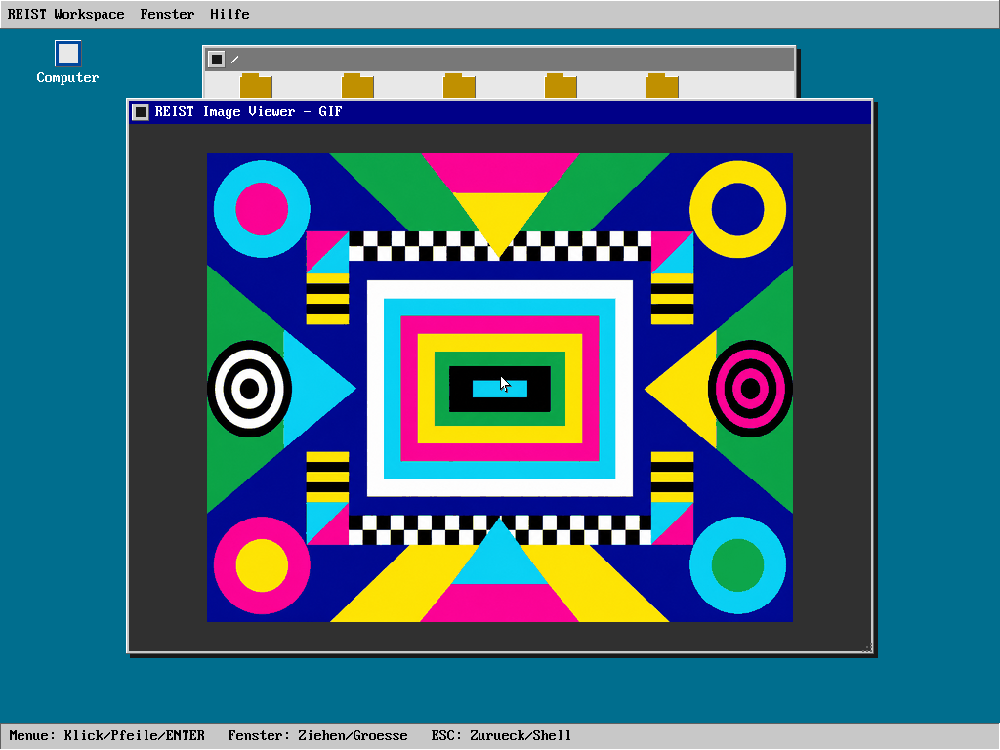

# Grafischer Desktop und Window-Manager: VMware-Workflow

Stand: 20. August 2026.

Dieses Dokument ist die schrittweise Arbeitsliste für den sichtbaren Ausbau
des REIST-Desktops unter VMware Workstation. Eine Checkbox wird erst nach
Codeprüfung und dem jeweils genannten Nachweis abgehakt. Der aktuelle
Haupt-Worktree bleibt die einzige Arbeitskopie, damit jede Änderung sofort in
der IDE sichtbar ist.

## Zielbild

`desktop.prg` ist der feste Ring-3-Session-Compositor und Window-Manager. Er
besitzt als einzige Desktopkomponente globale
Fensterpositionen, Z-Order, Fokus, Pointer-Capture und die Zusammenstellung des
sichtbaren Bildes. Migrierte GUI-Programme liefern ausschließlich Inhalt für
ihre lokale Clientfläche und erhalten weder den linearen Framebuffer noch
globale Fensterkoordinaten oder fremde Eingaben.

Die Gestaltung orientiert sich an klassischen, klar lesbaren Oberflächen wie
Amiga Workbench und Windows 3.1: Menüleiste, Desktopicons, überlappende Fenster,
deutlich markierte aktive Titelleiste, einfache Rahmen und vorhersehbare
Tastaturbedienung. Das Erscheinungsbild ändert nicht die Sicherheitsgrenzen.



*Automatischer QEMU-Nachweis: Desktop-Compositor mit getrennten
Ring-3-Surface-Clients.*

Der sichtbare Produktname ist **REIST Workspace**. `desktop.prg` bleibt der
kompatible technische Programmname und `desktop` der Shell-Startbefehl. Der
Begriff „Windows“ wird nur für die Microsoft-Referenz oder auf Englisch für
einzelne Fenster verwendet, nicht als Name der REIST-Oberfläche.

## Quell- und Installationsstruktur

GUI-Code wird nicht mit Console- und Shellprogrammen vermischt. Die aktuelle
und künftige Struktur lautet:

| Quellpfad | Inhalt und Vertrauensgrenze |
|---|---|
| `userspace/gui/compositor/` | vertrauenswürdiger Session-Compositor und Window-Manager |
| `userspace/gui/apps/<name>/` | je ein eigener GUI-Clientprozess pro Anwendung; migrierte Programme verwenden Surface IPC |
| `userspace/gui/examples/` | kleine, gegen das installierte SDK baubare Beispiele |
| `userspace/gui/include/reist/gui/` | versionierte öffentliche C-APIs; In-Process-Controls und Surface IPC bleiben getrennte Schichten |
| `userspace/gui/lib/` | begrenzte wiederverwendbare Controls, Dialoge, Surface-Client- und Zeichenkomponenten |
| `userspace/gui/share/` | versionierte, nur lesbare GUI-Ressourcen; weitere Icons, Fonts und Themen folgen hier |
| `userspace/programs/` | Console- und Systemprogramme ohne GUI-Clientrolle |
| `userspace/bin/` | interaktive Consoleprogramme wie Shell und Editor |

Im Zielabbild liegen direkt startbare GUI-Programme unter `/usr/gui/bin` und
architekturunabhängige Ressourcen künftig unter `/usr/gui/share`. Das
Entwicklungs-SDK verwendet dagegen den üblichen Sysroot-Aufbau `/usr/include`
und `/usr/lib`; eine dynamische Runtime-Bibliotheks-ABI wird erst mit einem
versionierten Loader festgelegt. Die Ring-3-Shell führt `/usr/gui/bin` in ihrem
festen, begrenzten Suchpfad. `/DESKTOP.PRG` und `/usr/bin/desktop.prg` bleiben
feste Kompatibilitätsaliase; neuer Code verwendet ausschließlich
`/usr/gui/bin/desktop.prg`. Die vollständige Besitzregel steht zusätzlich in
`userspace/gui/README.md`.

## Toolchain-, SDK- und Dokumentationsprofil

REIST implementiert weder Compiler noch Assembler, Linker, Archivformat oder
eine eigene C-Sprache. C11 wird freestanding mit Zig/Clang übersetzt, BIOS-
und Bootassembler mit NASM, ELF32 mit LLD gelinkt und `libreistgui.a` mit dem
gewöhnlichen `ar`-Format erzeugt. Externe Programme verwenden `-I`, `-L` und
`-l`; nur die streng geprüfte Verpackung des festen ELF32-Ergebnisses als MYPR
v1 ist betriebssystemspezifisch.

`crt0.o`, `libreistos.a`, `libreistnetparse.a` und `libreistgui.a` werden pro
Systembuild einmal erzeugt. Danach bauen höchstens acht feste Worker die
voneinander unabhängigen PRGs; `--jobs` kann diese Grenze weiter reduzieren.
Der inhaltsadressierte globale Zig-Cache wird
geteilt, jeder Übersetzungslauf behält jedoch seinen isolierten lokalen Cache;
die Ergebnisreihenfolge bleibt deterministisch. Damit ist Modularität auch ein
ausgeführter Buildvertrag und nicht nur eine geplante Verzeichnisstruktur.
SDK-Archive behalten bei Änderungen fremder Komponenten ihren Zeitstempel;
Core-Programme beobachten keine GUI-Header. Dadurch baut eine GUI-Änderung
inkrementell nur `libreistgui.a` und die davon abhängigen `DESKTOP.PRG` und
`GUIDEMO.PRG`, während vollständige
Host-, Paket- und Laufzeitgates weiterhin an ihren festgelegten Grenzen laufen.

Das verbindliche Schichten-, Portabilitäts- und Dokumentationsmodell steht in
[Userspace-SDK, Toolchain und Portabilitätsvertrag](../architecture/USERSPACE_SDK_AND_PORTABILITY.md).
Öffentliche Header sind Doxygen-kompatibel und dokumentieren Ownership,
Lebensdauer, Versionen, Einheiten, Kapazitäten, Seiteneffekte und Fehler. Zu
jeder Bibliothek gehören ein baubares Beispiel, Host-Verhaltenstest und ein
Buildtest gegen das installierte Sysroot. Diese Unterlagen werden zugleich so
geführt, dass sie später als technische Quellenbasis für das Buch *Writing a
Graphical Operating System from Scratch* dienen können.

## Architektur-Kompatibilitätsprofil

REIST übernimmt das etablierte Wayland/xdg-shell-Modell auf Ebene der
Architektur und Semantik, aber derzeit weder dessen Wire-Format noch eine
Binärkompatibilität. Damit bleibt eine spätere Protokollbrücke möglich, ohne
jetzt Linux-, Socket-, `mmap`- oder dynamische Objektabhängigkeiten in den
Kernel zu ziehen. Neue GUI-ABI-Entwürfe müssen die folgende Zuordnung
beibehalten oder eine begründete Abweichung dokumentieren.

| Etabliertes Konzept | Verbindliche REIST-Entsprechung |
|---|---|
| `wl_compositor` / Session-Compositor | genau ein Ring-3-Prozess setzt die sichtbare Szene zusammen und vermittelt Eingaben |
| `wl_surface` | owner- und generationsgebundene, rechteckige Clientoberfläche ohne globale Position |
| `attach` + `damage_buffer` + `commit` | Buffer, begrenzten Schaden und atomare Veröffentlichung als getrennte Zustände führen |
| xdg-Toplevel-Rolle | genau eine dauerhafte Rolle pro Surface; Platzierung und Dekoration gehören dem Compositor |
| `configure` + `ack_configure` | neue Größe/Zustand erhält eine Seriennummer und wird erst nach passender Bestätigung sichtbar |
| `wl_seat`, Pointer- und Keyboard-Fokus | Geräte gruppieren, Fokusarten trennen und Events nur an den berechtigten Besitzer liefern |
| implizites Pointer-Grab | Button-Down bindet die Sequenz bis zum passenden Button-Up an genau ein Ziel |
| Buffer-Release | ein Client darf einen noch vom Compositor gelesenen Buffer nicht überschreiben |

Bewusst nicht übernommen werden globale Clientkoordinaten, direktes
Framebuffer-Sharing, unbeschränkte Objekt-/Eventmengen, wiederverwendete IDs
ohne Generation, synchrone Rundreisen im Renderpfad und implizites Vertrauen
in Clientgeometrie. Diese Abweichungen reduzieren bekannte Race-,
Ressourcenerschöpfungs- und Stale-Handle-Risiken, ohne das sichtbare
Fenstermodell zu verändern. Maßgeblich sind die offizielle
[Wayland-Architektur](https://wayland.freedesktop.org/docs/book/Architecture.html),
das [Protokoll- und Surface-Modell](https://wayland.freedesktop.org/docs/book/Protocol.html)
und die [stabile xdg-shell-Spezifikation](https://gitlab.freedesktop.org/wayland/wayland-protocols/-/blob/main/stable/xdg-shell/xdg-shell.xml).
Eine spätere
Kompatibilitätsbehauptung benötigt einen eigenen Interoperabilitätstest; die
Ähnlichkeit der Architektur allein genügt dafür nicht.

Für jede spätere öffentliche GUI-Operation wird vor dem Code ein kurzer
Standardsabgleich festgehalten: Referenzoperation, übernommene Semantik,
bewusste Abweichung, Sicherheitsgrund und Regressionstest. Eine eigene
Semantik ohne diesen Nachweis blockiert die betreffende Checkbox.

## Verbindliche Architekturregeln

- Der Compositor ist für Ausgabe und Eingabe-Routing zuständig. Dieses Modell
  folgt der Trennung aus der offiziellen
  [Wayland-Architektur](https://wayland.freedesktop.org/docs/book/Architecture.html),
  ohne das Wayland-Protokoll oder dessen Linux-Abhängigkeiten zu kopieren.
- Nur der Window-Manager kennt globale Position, Z-Order und Fokus. Ein Klick
  aktiviert genau ein Fenster und hebt nur dieses in der Reihenfolge an. Das
  entspricht den grundlegenden
  [Window-Management-Regeln](https://learn.microsoft.com/en-us/windows/win32/uxguide/win-window-mgt).
- Nach einem Button-Down hält der Window-Manager ein implizites, einzelnes
  Pointer-Capture bis zum passenden Button-Up. Dadurch bleibt ein Ziehvorgang
  auch außerhalb der Titelleiste wohldefiniert; siehe das offizielle
  [Mouse-Capture-Modell](https://learn.microsoft.com/en-us/windows/win32/inputdev/about-mouse-input).
- Zustandsänderung und Zeichnen bleiben getrennt. Nach dem MVP werden nur
  begrenzte ungültige Bereiche neu aufgebaut, entsprechend dem etablierten
  [Update-Region-Modell](https://learn.microsoft.com/en-us/windows/win32/gdi/redrawing-in-the-update-region).
- Alle Register, Fenster, Schäden, Events und Clientressourcen besitzen feste
  Kapazitäten. Keine unbeschränkte Queue, keine Rekursion über fremde
  Fensterbäume und kein Busy-Wait.
- Ring 3 erhält kein LFB-Mapping und keine I/O-Rechte. Der Kernel validiert
  weiterhin jede Displayoperation und der Compositor ist der einzige
  Desktopprozess, der die Pixel-ABI verwenden darf.
- Eine Clientoberfläche wird erst durch einen validierten `commit`
  sichtbar. Unvollständige oder veraltete Generationen dürfen nie teilweise
  publiziert werden.
- Bestehende Console-Programme werden nicht fälschlich als Fensterprogramme
  ausgegeben. Die GUI-Client-ABI ist vorhanden; nicht migrierte Programme
  starten bewusst über die Vollbildbrücke und kehren danach zum Desktop zurück.
- Physische Host-Tastatur und -Maus werden niemals an VMware durchgereicht.
  Die VM verwendet ausschließlich virtuelle PS/2-Tastatur und virtuelle
  USB-HID-Maus.

## Multitasking- und Prozessgrenze

Präemptives Multitasking benötigt nicht zwingend mehrere CPU-Kerne. Der
aktuelle REIST-Kernel plant mehrere Tasks mit Zeitquantum auf einem Kern und
besitzt getrennte Prozessidentitäten und Adressräume; SMP ist eine davon
unabhängige spätere Ausbaustufe. Für die GUI genügt diese Aussage allein aber
nicht als Nachweis vollständiger Diensttrennung.

Der jetzige `desktop.prg` ist noch ein einzelner Session-Compositor-Prozess.
Seine Rasteroperationen bleiben präemptibel; nur kurze Zustandsübergänge sind
gesperrt. Offene Frames gehören immer PID plus Prozessgeneration, besitzen
eine feste Lease und werden sowohl bei normalem Task-Ende als auch bei einer
erzwungenen Terminierung bereinigt. Dadurch blockiert ein pausierter oder
beendeter Zeichner weder Scheduler noch Display dauerhaft.

Stufe 3 hat für client-eigene Controls, modale Dialoge und echte
GUI-Anwendungen insbesondere nachgewiesen:

- Compositor, GUI-Clients und Systemdienste laufen als getrennte Prozesse in
  getrennten Adressräumen und kommunizieren ausschließlich über validierte,
  begrenzte IPC.
- Jeder Client besitzt eigene generationsgebundene Surface-Handles und eine
  feste Eventqueue; kein Client kann Fokus, Z-Order oder fremde Buffer ändern.
- Ein blockierter, abgestürzter oder CPU-intensiver Client verhindert weder
  Eingabe noch Darstellung anderer Clients; Fairness und Cleanup werden im
  Gast getestet.
- Keine GUI-Sperre wird über einen blockierenden IPC-Aufruf, einen Wait oder
  eine lange Rasteroperation gehalten.

Bis diese Nachweise bestehen, wird weder vollständige GUI-Prozessisolation
noch SMP-Unterstützung behauptet.

## Stufe 0: belastbare Ausgangslage

- [x] VGA-Boot kann `desktop.prg` starten und VMware SVGA-II aktivieren.
- [x] Escape deaktiviert den Laufzeitgrafikmodus und stellt die VGA-Shell her.
- [x] Ring-3-Rechtecke und Pixelschrift sind geclippt und validiert.
- [x] Der Kernel zeichnet einen sichtbaren Softwarepointer über der Szene.
- [x] VMware-HID-Passthrough ist in der generierten VMX verboten.
- [x] Vier vorhandene Programme sind über den Desktop startbar.
- [x] Der bisherige Stand ist als Vollbild-Launcher, nicht als Window-Manager,
  inventarisiert.

## Stufe 1: sichtbarer Window-Manager-MVP

Sichtbares Ergebnis: Unter VMware liegen mindestens zwei klassische Fenster
übereinander. Sie können fokussiert, nach vorne geholt, an der Titelleiste
verschoben und über das Schließfeld geschlossen werden.

- [x] Feste Kapazität für vier Top-Level-Fenster definieren; kein Heap.
- [x] Fensterzustand von der Renderfunktion trennen.
- [x] Explizite Z-Order und genau ein fokussiertes Fenster verwalten.
- [x] Hit-Test von vorne nach hinten implementieren.
- [x] Implizites Pointer-Capture für Verschieben und Schließfeld umsetzen.
- [x] Fenster beim Ziehen vollständig im nutzbaren Arbeitsbereich halten.
- [x] Aktive und inaktive Titelleisten sichtbar unterscheiden.
- [x] Desktopicons für Shell, Dateien, Editor und System zeichnen.
- [x] Mausbedienung: Icon öffnen, Fenster fokussieren, ziehen und schließen.
- [x] Tastaturbedienung: Auswahl mit Tab/Pfeilen, Start mit Enter, Ende mit Esc.
- [x] Legacy-Programme weiterhin mit geprüftem Wait und Kill/Reap-Fehlerpfad im Vollbild
  starten und danach die Fensterszene vollständig wiederherstellen.
- [x] Quell- und Hosttests für Kapazität, Z-Order, Capture und Bounds ergänzen.
- [x] VMware-Paket erfolgreich bauen.
- [x] Manueller VMware-Sichtnachweis durch den Benutzer.

Abnahme vom 19. August 2026: Szene, Fenster, Dekorationen und Pointer wurden
unter VMware sichtbar bestätigt. Der Benutzer hat außerdem Mausbewegung,
Fokus/Z-Reihenfolge, Fensterziehen sowie Schließen und erneutes Öffnen
erfolgreich geprüft. Reale Hardware wurde für diesen Window-Manager-Stand noch
nicht geprüft.

Der damalige statische Vier-Programm-Launcher wurde danach ersetzt. Sichtbare
Top-Level-Slots besitzen nun immer einen gültigen Explorer-Snapshot; der WM
erzeugt beim Start keine inhaltslosen Platzhalterfenster mehr.

Für diese Stufe ist ein vollständiger Szenenaufbau nach einer geometrischen
Änderung zulässig. Er ist ausdrücklich nur die sichere Referenz, bis die
Schadens- und Frame-Publikation aus Stufe 2 verfügbar ist.

## Stufe 2: Compositor-Kern und flüssige Frame-Publikation

Sichtbares Ergebnis: Ein gezogenes oder an Kante beziehungsweise Ecke in der
Größe geändertes Fenster bewegt sich ohne vollständiges Neuzeichnen des
Bildschirms und ohne schrittweise sichtbaren Bildaufbau.

- [x] Typisierten, zentralen Event-Dispatch statt direkter Eingabe-Manipulation
  des Fensterzustands einführen.
- [x] Pointer- und Keyboard-Fokus als getrennte Zustände führen.
- [x] Implizites Pointer-Grab für jede Button-Down-Sequenz bis Button-Up
  beibehalten, auch außerhalb des Ursprungsfensters.
- [x] Feste Liste von höchstens acht Damage-Rechtecken definieren.
- [x] Überlappende Schäden begrenzt vereinigen; bei Überlauf kontrolliert auf
  einen Vollbildschaden zurückfallen.
- [x] Alle Desktop- und Fensterprimitive an ein explizites Clip-Rechteck binden.
- [x] Kernel-ABI für owner- und generationsgebundenes
  Frame-Begin/Commit/Cancel append-only in den vorhandenen Display-Control-
  Syscall integrieren.
- [x] Frame-Lease, Seriennummer, Draw-Reservation und Cleanup in beiden
  Scheduler-Exit-Pfaden umsetzen; keine nach Prozessende hängenbleibende
  Batch-Sperre.
- [x] Shadow-Framebuffer während eines Frames beschreiben und den validierten
  Schaden erst beim Commit an VMware SVGA-II präsentieren.
- [x] Höchstens acht VMware-Updates in einem FIFO-Batch mit genau einer
  abschließenden SVGA-Synchronisation veröffentlichen.
- [x] Softwarepointer vor dem Szenenaufbau restaurieren und anschließend als
  oberste Ebene erneut setzen.
- [x] Alte und neue Fensterposition sowie freigelegte und überdeckte Fenster
  durch vollständige Back-to-front-Komposition innerhalb der Dirty Regions
  korrekt invalidieren.
- [x] Serverseitigen Resize-Hit-Test für vier Kanten und vier Ecken mit fester
  sechs Pixel breiter Dekorationszone umsetzen; das Schließfeld behält Vorrang.
- [x] Resize vom Button-Down bis Button-Up unter demselben impliziten Capture
  halten und Pointerbewegungen nicht an ein anderes Fenster umleiten.
- [x] Gegenüberliegende Kante beim Ziehen festhalten, Mindestgröße erzwingen
  und jede Geometrie auf den nutzbaren Arbeitsbereich begrenzen.
- [x] Alte und neue Resize-Geometrie als Dirty Regions rekonstruieren, während
  eines Live-Resize zusätzlich den vollständigen Bereich der Button-Down-
  Geometrie invalidieren und eine sichtbare Griffmarkierung zeichnen. Dies
  reduziert Zwischenbilder bei zusammengefassten Pointer-Reports.
- [x] Hosttests für Dirty-Überlauf, Fokusarten, Event-Dispatch, implizites Grab,
  Kanten-/Ecken-Resize, Mindestgröße, Bounds, Stale-Serial, Timeout und
  Prozesscleanup ergänzen.
- [x] VMware-Paket mit Kernel und aktualisiertem `DESKTOP.PRG` bauen.
- [x] Compositor-Quellen in den eigenen GUI-Baum verschieben und die
  Zielabbilder unter `/usr/gui/bin` vereinheitlichen.
- [x] Direkten Start über den begrenzten Userspace-Shell-Pfad sowie feste
  Legacy-Pfadaliase durch Quell- und Image-Layout-Tests absichern.
- [x] Versionierte Messwerte für Vollbildaufbau, Fensterzug und Resize im
  seriellen QEMU-Test protokollieren.
- [x] USB-Motion-Reports innerhalb eines Frames bis zur nächsten Button-Kante
  zusammenfassen, damit langsamer Scanout nur die letzte Fensterposition und
  nicht alle während des vorigen Frames aufgelaufenen Zwischenpositionen
  komponiert.
- [x] Shadowbuffer-Damage mit gebündelten 32-Bit-Transfers und genau einer
  Write-Combining-Barriere pro Publikation in den VBE-LFB übertragen.
- [x] Den vollständigen Inhalt eines bewegten Fensters oder Dialogs aus dem
  letzten Shadowbuffer-Bild in einen festen Kernel-Cache übernehmen, den
  freigelegten Hintergrund neu komponieren und beides mit einem Frame-Commit
  atomar an der Zielposition veröffentlichen.
- [x] Zeichen inklusive ihrer Hintergrundpixel an der exakten Dirty Region
  clippen, damit Fensterbewegungen keine Explorer-Labels über Damage- und
  Z-Order-Grenzen hinweg beschädigen.
- [x] VMware-Sichttest ohne Flackern oder stehenbleibende Fensterreste.
- [ ] Dialog-Drag und neuen klassischen Mauszeiger auf dem ASUS/NVIDIA-Ziel
  visuell und anhand der ausgegebenen Render-Metriken abnehmen.

Die Frame-ABI ist bewusst eine Publikationsgrenze, keine globale
Compositor-Sperre. Längere Rechteck- und Textoperationen bleiben präemptibel;
konkurrierende Zeichner werden begrenzt mit Fehlerstatus abgewiesen. Das
gegenwärtige Dirty-Redraw zeichnet innerhalb jedes Clips Hintergrund, Icons
und sichtbare Fenster erneut in Z-Reihenfolge. Damit werden freigelegte Flächen
korrekt rekonstruiert, ohne den restlichen Bildschirm neu aufzubauen. Resize
ist bewusst eine serverseitige Top-Level-Operation: Der Compositor besitzt
Hit-Test, Geometrie und Dekoration; ein späterer Client erhält die neue
Clientgröße ausschließlich über die versionierte `configure`-/
`ack_configure`-Grenze aus Stufe 3.

Der interaktive Eingabepfad behandelt Button-Down und Button-Up weiterhin als
strikte Ordnungsgrenzen. Dazwischen werden die höchstens 32 fest begrenzten
relativen USB-Motion-Reports eines Schleifendurchlaufs zu genau einer
Endposition addiert. Das entspricht üblichem Compositor-Frame-Coalescing:
Pointer-Capture und Klicksemantik bleiben unverändert, während Zwischenstände,
die nie sichtbar waren, keine wachsende Damage-Fläche mehr erzeugen. Der
Kernel kopiert die resultierenden Shadowbuffer-Zeilen ohne SIMD-/FPU-Zustand
per gebündeltem Dword-Transfer und schließt eine Publikation mit einer einzigen
WC-Barriere ab.

Beim reinen Fensterzug bleibt der vollständige Fensterinhalt sichtbar; es gibt
bewusst keinen Rahmen- oder Drahtgittermodus. Die angehängte Operation
`FRAME_STAGE_BLIT` von Syscall 109 kopiert höchstens ein geprüftes Rechteck aus
dem aktuellen Kernel-Shadowbuffer in einen festen, nicht dynamisch allozierten
Zwischenspeicher. Sie ist an PID, Prozessgeneration und Frame-Serial gebunden.
Ring 3 komponiert anschließend nur die am alten Ort freigelegte Szene ohne das
bewegte Objekt. Erst der Commit setzt den gespeicherten Fensterinhalt an die
neue Position, vereinigt die begrenzten Damage-Rechtecke und publiziert den
fertigen Zustand. Bei zusätzlichem Schaden, Resize, ungültiger Geometrie oder
fehlendem Shadowbuffer wird ohne Zustandsverlust der normale Redraw verwendet.

Automatischer QEMU-Nachweis vom 19. August 2026: ein Vollbildframe, acht
Move-Frames und acht Resize-Frames; `full_max_ms=7`, `drag_max_ms=80`,
`resize_max_ms=84`, `damage_max=1`, keine Immediate-Fallbacks sowie keine
Zeitquellen- oder Probe-Fehler. Das vollständige Laufprotokoll liegt unter
`build/codex-agent/20260819-154449-runtime-desktop-metrics.log`.

## Stufe 3: versionierte GUI-Client- und Surface-ABI

Sichtbares Ergebnis: Ein separater Ring-3-Testclient öffnet ein echtes Fenster,
zeichnet darin und erhält nur die für ihn bestimmten lokalen Eingaben.

- [ ] Vor der Implementierung einen eigenen, begrenzten Arbeitspaketvertrag
  mit den benötigten IPC-, Speicher- und Prozessdateien festlegen.
- [x] Den initialen festen Surface-/Event-ABI-Entwurf in
  `<reist/gui/surface.h>` dokumentieren; er gewährt noch keinen
  Displayzugriff und wird erst nach dem Capability-Nachweis aktiviert.
- [x] Einen nichtblockierenden, kapazitätsbegrenzten Desktop-IPC-Broker
  implementieren; der Broker bleibt bis zur Client-Delegation desktop-owned.
- [x] Broker-Lifecycle, Nonblocking-Polling und fehlende Display-Seiteneffekte
  mit einem Source-Regressionstest absichern.
- [ ] Semantik-Matrix zu Wayland Core und stabilem xdg-shell vollständig
  ausfüllen; jede bewusste Abweichung mit Sicherheitsgrund und Test versehen.
- [x] Feste Surface-Handles mit Generation, Besitzer-PID und Rechten definieren.
- [x] Höchstzahlen für Clients, Fenster, Surfacebytes und ausstehende Requests
  festlegen und vor Seiteneffekten prüfen.
- [x] Requests mindestens für `create`, `destroy`, `attach`, `damage_buffer`,
  `commit`, `configure`, `ack_configure` und `buffer_release` versionieren.
- [x] Für die erste isolierte Fensteranwendung einen mediierten, retained
  Zeichenstrom festlegen: maximal 192 lokale Fill-/Text-Kommandos werden in
  einer Pending-Liste validiert und erst mit `paint_commit` atomar sichtbar.
  Der Editor nutzt diesen Strom weiterhin ohne Framebufferrecht.
- [x] Pixelbuffer-Transport für Rasteranwendungen fertigstellen: Der Client
  lädt einen vollständig validierten, unveränderlichen XRGB8888-Puffer in eine
  auf acht MiB begrenzte, statische 4-KiB-Blockressource ohne Kernel-Heap. Nur
  der generationsgenaue
  Eltern-Compositor darf daraus geclippte Teilrechtecke zeichnen. Es gibt kein
  LFB-Mapping und kein veränderliches Shared Memory; `attach`, `damage`,
  `commit` und Release bleiben getrennte, bestätigte Zustände.
- [x] Gemeinsame, zugriffsfreie Descriptor-Validierung in der GUI-Library
  bereitstellen.
- [x] Surface-Protokoll für Buffer-Create/Destroy auf Version 2 anheben; alte
  Nachrichten werden anhand Version und Strukturgröße abgewiesen.
- [x] Surface-Protokoll für atomare Paint-Listen, Fenstertitel und
  Resize-Configure auf Version 3 anheben; unbekannte ältere Wire-Versionen
  bleiben fail-closed.
- [x] Surface-Protokoll auf Version 4 anheben und Buffer-Release erst nach dem
  atomaren Austausch des vorherigen Compositor-Puffers melden.
- [x] Client kennt nur lokale Koordinaten; Platzierung und Dekoration bleiben
  vollständig beim Compositor.
- [x] Keyboardfokus und Pointerfokus getrennt und generationsgebunden an den
  Besitzer der fokussierten beziehungsweise getroffenen Surface routen.
- [x] Pointer-Button-Sequenzen erhalten über das WM-Client-Capture ein
  implizites Grab bis Button-Up.
- [ ] Veraltete Handles, falsche Besitzer, ungültige Größen und unbestätigte
  Commits ohne sichtbare Teilwirkung ablehnen.
- [x] Prozessende oder gebrochener IPC-Kanal widerruft Besitzer-Surfaces und
  entfernt ihre WM-Fenster idempotent beim nächsten Synchronisationsschritt.
- [ ] Ein absichtlich abgestürzter Client beschädigt weder Desktop noch andere
  Fenster.
- [x] `surfacedemo.prg` als ersten separaten Ring-3-Client asynchron starten,
  nach Prozessgeneration an den Broker binden und als verschiebbares,
  skalierbares sowie schließbares WM-Fenster darstellen.
- [x] Clientgelieferten Inhalt mit atomaren, doppelt gepufferten Paint-Listen
  darstellen; Fensterbewegung und Überdeckung verwenden ausschließlich den
  committed Frame. Resize wird per `configure`/`ack_configure` ausgehandelt.
- [x] Acht feste WM-/Explorer-Slots bereitstellen, damit die Navigation bis
  `/usr/gui/bin` nicht bereits alle Fensterplätze vor dem Clientstart belegt.

## Stufe 4: kleine GUI-Bibliothek

Sichtbares Ergebnis: GUI-Programme verwenden gemeinsame Controls statt eigener,
inkompatibler Fensterrahmen.

- [x] Clientbibliothek für Surface-Lebenszyklus und Eventdispatch bereitstellen.
- [x] Einen bounded Endpoint-Bootstrap für GUI-Programme definieren
  (`--reist-surface=<handle>`); ungültige Werte werden abgewiesen.
- [x] Geclippte lokale Fill-/Text-Primitive im Surface-Clientwrapper kapseln;
  globale Koordinaten oder Framebufferrechte überschreiten die ABI nicht.
- [x] Rendererunabhängigen, versionierten Menücontroller mit festen
  Kapazitäten, lokaler Geometrie, implizitem Capture, Tastaturnavigation und
  begrenzten Damage-Rechtecken als `libreistgui.a` bereitstellen.
- [x] Asynchronen Dialogcontroller mit modeless/window-modal/application-modal,
  Besitzer plus Generation, semantischen Responses, Default/Cancel,
  Buttonfokus und Move-Capture bereitstellen.
- [x] `guidemo.prg` als interaktive Referenz für alle derzeit öffentlichen
  Controls in beiden Image-Layouts paketieren und aus der Ring-3-Shell
  erreichbar machen.
- [x] Rendererunabhängige Controls für Label, Pushbutton, Checkbox und
  exklusive Radiogruppen mit fester Kapazität bereitstellen.
- [x] Tab-Fokusreihenfolge, Space/Enter-Aktivierung und Pfeilnavigation für
  die implementierten Basis-Controls bereitstellen.
- [x] Verschachtelbaren Containerbaum mit Parent-lokaler Geometrie,
  Ancestry-Clipping und adressiertem Capture/Target/Bubble-Pfad definieren.
- [x] Tabsheet mit genau einer sichtbaren Page, Pointer-Capture und
  Links/Rechts/Home/End-Navigation implementieren.
- [x] Controls für einzeiliges Textfeld, Liste, Scrollbar, Slider, SpinBox und
  Fortschrittsanzeige definieren und in `guidemo.prg` interaktiv zeigen.
- [x] Rendererunabhängiges Mehrzeilen-Textmodell mit festem, vom Aufrufer
  besessenem Puffer, Cursor, Viewport und begrenztem Eventdispatch bauen.
- [x] Mehrzeileneditor an einen echten öffentlichen GUI-Client mit Rendering,
  Dirty-State, Laden, atomarem Speichern und modalen Exit-Dialogen anbinden.
- [x] Asynchrones Datei-Öffnen-/Speichern-Control mit absolutem Pfad,
  Pointer-/Tastaturbedienung und typisiertem Accept/Cancel bereitstellen;
  der Editor bietet Öffnen, Speichern und Speichern unter.
- [x] Menü- und Dateidialog-Aktivierung im echten Surface-Gastpfad prüfen;
  vorübergehende Paint-Backpressure verwendet begrenzte Einzeloperationen mit
  5-ms-Backoff und beendet den Client nicht. Der Broker leert die vierfache
  IPC-Queue in höchstens 64 fairen Round-Robin-Runden je Desktopzyklus.
- [ ] Selection/Clipboard und eine allgemeine ScrollView ergänzen; TreeView
  und ComboBox folgen später.
- [x] Fensterrahmen, Titel, Schließen und Größenänderung bleiben serverseitig;
  Clients zeichnen keine konkurrierenden Dekorationen.
- [ ] Farb- und Metrikthema zentral versionieren.

## Stufe 5: echte Desktopprogramme

- [ ] Systeminformationen als erster read-only GUI-Client.
- [x] Erste begrenzte Dateimanager-Schicht mit Root-Icon, atomarem
  Verzeichnis-Snapshot, Ordner-/Dateiicons und neuen Ordnerfenstern.
- [x] Editor als separaten, asynchronen Surface-Client mit begrenztem
  Textpuffer, Speichern, Dirty-Anzeige, lokalen Eingaben, Resize-Configure und
  modalem Close-/Save-Vertrag betreiben.
- [x] Bildbetrachter als separaten Surface-Client mit validierten,
  generationengebundenen XRGB8888-Buffern betreiben.
- [ ] Sound Player und Control Gallery auf Surface-Clients migrieren.
- [ ] Terminalemulator als eigener GUI-Client statt globaler Console-Ausgabe.
- [x] Verzeichnisse per Doppelklick/Enter in einem neuen Fenster öffnen und
  `.PRG`-Dateien über ihren kanonischen VFS-Pfad starten.
- [x] Versionierte, fest begrenzte Dateizuordnungen aus
  `/etc/reist/filetypes.conf` laden und den Dateipfad per `argv[1]` an das
  zugeordnete GUI-Programm übergeben.
- [x] Explorer-, Dateizuordnungs- und Programmstartfehler als verschiebbare
  application-modale Dialoge mit begrenztem Pfaddetail anzeigen; keine
  Konsolenausgabe darf die grafische Desktopfläche überschreiben.
- [ ] Legacy-Vollbildbrücke erst entfernen, wenn alle vier Kernprogramme eine
  getestete GUI-Variante besitzen.

Der aktuelle Explorer ist bewusst compositorintern und auf acht Fenster sowie
32 Einträge je Snapshot begrenzt. Ein vollständiger Client/Server-Dateimanager
folgt als eigener Client in einer späteren Stufe. Noch nicht migrierte
Legacy-Programme können den
Bildschirm temporär verwenden; der Desktop bleibt Elternprozess und setzt
seine Szene nach `wait` ohne Shellwechsel oder zusätzlichen Tastendialog neu
zusammen.

## Systemkonfiguration

- [x] `/etc/reist` als systemweiten, administrierbaren Namensraum festlegen.
- [x] Versionierte Standarddateien für System/Sprache, Eingabe, Desktop und
  Dateizuordnungen in Windows- und Makefile-Systemabbilder paketieren.
- [x] `/usr/share/reist/defaults`, `/var/lib/reist` und spätere
  `$HOME/.config/reist`-Überschreibungen voneinander abgrenzen.
- [ ] Gemeinsamen fest begrenzten Ring-3-Parser und atomaren Writer bauen.
- [ ] Sprache, Tastatur, Maus und Desktop über einen berechtigten Systemdienst
  und grafische Einstellungswerkzeuge änderbar machen.

Der Format- und Pfadvertrag steht in
[`SYSTEM_CONFIGURATION.md`](../architecture/SYSTEM_CONFIGURATION.md).

## Stufe 6: vollständige klassische Desktopfunktionen

- [x] Größenänderung mit Mindestgröße und Pointer-Capture (in Stufe 2
  vorgezogen, weil sie zur Geometrie- und Damage-Architektur gehört).
- [ ] Minimieren und Wiederherstellen über eine feste Fensterleiste.
- [ ] Maximieren und exakte Rückkehr zur vorherigen Geometrie.
- [x] Menüleiste mit Desktop-, Fenster- und Hilfeaktionen über die öffentliche
  Menü-API implementieren; Fensteraktionen laufen über typisierte WM-Events.
- [x] Compositor-eigene Hilfe als modeless und Info als application-modal über
  die öffentliche Dialog-API zeichnen; Responses und Pointer-Capture bleiben
  im Controller gebunden.
- [ ] Modale Dialoge bleiben an ihren Besitzer gebunden und darüber gestapelt.
- [ ] Tastaturkürzel für Fensterwechsel, Schließen und Menübedienung.
- [ ] Klick-, Popup-, Dialog- und Tastaturnachweis manuell unter VMware führen.
- [ ] Optionales Double-Click erst mit monotoner Zeit und fester Schwelle.
- [ ] Fensterplatzierung bleibt nach Auflösungswechsel im Arbeitsbereich.

Automatischer Nachweis vom 19. August 2026: Menü- und Dialog-Hosttests prüfen
Titelwechsel, implizites Capture, Maus- und Tastaturaktivierung, deaktivierte
Einträge, Modalität, Responses, Titel-Drag sowie ungültigen State. Die
`guidemo.prg`-Quell- und Buildtests prüfen zusätzlich die alleinige Nutzung
öffentlicher Header, beide Imagepfade und die Erreichbarkeit aus der
Ring-3-Shell. Der Gast-Renderprobe öffnet das Hilfe-Menü, aktiviert den
modeless Hilfe-Dialog, verschiebt ihn und schließt ihn per Escape, ohne die
feste Anzahl von acht Move- und acht Resize-Frames zu
verändern. `runtime-desktop-metrics` bestand mit `full_max_ms=8`,
`drag_max_ms=82`, `resize_max_ms=4` und ohne Probe-Fehler. Der manuelle
VMware-Sicht- und Klicktest bleibt bewusst offen.

Die derzeitige Text-ABI besitzt noch kein frei wählbares Glyphen-Cliprechteck.
Ein enger partieller Szenen-Redraw könnte deshalb einen Glyphenteil löschen,
ohne ihn legal neu zeichnen zu können. Sichtbare Menü-Zustandswechsel werden
bis zur versionierten Clip-Erweiterung konservativ als atomarer Vollbild-Frame
publiziert; Pointerbewegungen innerhalb desselben Eintrags erzeugen weiterhin
keinen Redraw. Damit bleiben Menü-Header und benachbarte Titel korrekt, ohne
eine nicht vorhandene Clipping-Fähigkeit vorzutäuschen.

Desktop-Icons trennen außerdem Layout-/Hit-Zelle und sichtbaren Fokus: Die
große, feste Zelle bleibt ein gut bedienbares Maus- und Tastaturziel, während
nur ein kompakter Rahmen um das Symbol sowie die Beschriftung den aktiven
Eintrag markieren. Dadurch wird eine ausgewählte Anwendung nicht irrtümlich
als großflächiges Panel dargestellt. Die Beschriftung ist an der Unterkante
des sichtbaren Symbols verankert und steht damit unmittelbar beim zugehörigen
Icon; die Höhe der unsichtbaren Hit-Zelle beeinflusst ihre Position nicht.

## Stufe 7: Robustheit und Abnahme

- [ ] Fuzztests für ungültige GUI-Requests, Geometrien und Generationen.
- [ ] Kapazitätserschöpfung lässt bestehende Fenster unverändert bedienbar.
- [ ] Langsamer oder hängender Client blockiert Eingabe und Compositor nicht.
- [ ] Compositor-Neustart besitzt eine dokumentierte, begrenzte Recovery-Route.
- [ ] QEMU-Smoke für deterministische Eingabe und VMware-Sichtabnahme trennen.
- [ ] VGA-Rückkehr nach Desktopende bleibt nach jeder Stufe funktionsfähig.
- [ ] Dokumentation, ABI-Versionen, SDK und Beispielclient stimmen überein.

## Arbeitsablauf pro Checkbox-Gruppe

1. Bestehenden Mechanismus und betroffene Sicherheitsgrenze inventarisieren.
2. Einen gezielten Regressionstest ergänzen oder verschärfen.
3. Kleinste vollständige Änderung innerhalb des freigegebenen Scopes umsetzen.
4. Quelltests und den nativen VMware-Build ausführen.
5. Bei sichtbaren Änderungen die VM starten und genau die neue Interaktion
   prüfen; keine Wiederholung bereits belegter Hardwaretests.
6. Diff auf ABI-Drift, unbeschränkte Arbeit, fehlendes Cleanup und veraltete
   Dokumentation prüfen.
7. Nur belegte Checkboxen abhaken und den zusammengehörigen Stand committen.

## VMware-Sichttest

```powershell
.\scripts\build-windows.ps1 -Target vmware -Video vga
.\build\vmware\reist-os\START-VMWARE.cmd
```

Nach dem Shell-Prompt:

```text
C:\> desktop
```

Für den aktuellen Stand sind genau diese Handlungen abzunehmen:

1. Beide sichtbaren Startfenster abwechselnd anklicken; die aktive Titelleiste
   und Z-Order müssen wechseln.
2. Jedes Fenster an der Titelleiste bis an alle Arbeitsbereichsgrenzen ziehen.
3. Ein Fenster nacheinander an jeder Kante und jeder Ecke vergrößern und
   verkleinern; es darf weder kleiner als die Mindestgröße noch aus dem
   Arbeitsbereich gezogen werden.
4. Ein Fenster über das linke Schließfeld schließen und über sein Desktopicon
   erneut öffnen.
5. Eine Legacy-App mit Enter öffnen, beenden und die
   unveränderte Fensterszene wiedersehen.
6. Escape drücken und die bedienbare VGA-Shell erhalten.

### Abgenommener Resize-Redraw-Fix

Der beim schnellen oder mehrfachen Verkleinern des Editors sichtbare Restinhalt
wurde auf dessen retained Fill-/Text-Pfad eingegrenzt: Alte lokale
Paint-Rechtecke konnten über die bereits verkleinerte Clientfläche hinaus
gerendert werden. Der Compositor clippt diese Kommandos nun zusätzlich auf die
aktuelle Clientgeometrie; der störende grüne Editor-Surface-Rand wurde entfernt.
Der anschließende manuelle VMware-Sichttest mit dem neu gebauten Image wurde am
20. August 2026 erfolgreich abgenommen.

Der reproduzierbare Gastnachweis für Frame-Publikation und Resize verwendet
keine reale Host-Eingabe und führt jeweils genau acht Move- und Resize-Frames
aus:

```powershell
.\scripts\test-reist-runtime.ps1 -Mode runtime-desktop-metrics
```

Er akzeptiert ausschließlich den vollständigen Metrikvertrag Version 1,
keinen Immediate-Fallback, keine Zeitquellen- oder Probe-Fehler und höchstens
acht Damage-Rechtecke je Frame. Die manuelle VMware-Checkbox bleibt davon
getrennt, weil nur sie die sichtbare Interaktion und Flüssigkeit belegt.
